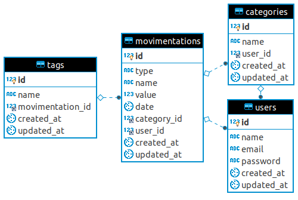

# Casher API

Casher is an app to manage all your bills.

This project is being developed in conjunction with the [@VictorioDev](https://github.com/VictorioDev) for study purposes and it is separated into 3 completely different parts.

- **Casher API (RESTful API): [lucianocarvalho/casher-api](https://github.com/lucianocarvalho/casher-api)**
- **Casher App (web application): [lucianocarvalho/casher-app](https://github.com/lucianocarvalho/casher-app)**
- **Flutter (iOS/Android application): [VictorioDev/CasherApp](https://github.com/VictorioDev/CasherApp)**

> :warning: This repository contains only the REST API, not the complete application. Check the other repositories.

## Table of contents:

* **[About](#about)**
* **[Endpoints](#endpoints)**
* **[Improvements](#improvements)**
* **[Bugs and features](#bugs-and-features)**
* **[Author](#author)**

## About

#### Requirements:
- **[PHP (^7.2)](https://php.net/releases/)**
- **[Composer (^1.8.4)](https://getcomposer.org/)**
- **[PostgreSQL (^10.9)](https://www.postgresql.org/docs/10/release-10-9.html)**

#### Database schema:




#### Installation:

1. Clone the repository:
```bash
git clone https://github.com/lucianocarvalho/casher-api
```

2. Install the dependencies:
```bash
cd casher-api && composer install
```

3. Rename .env file:
```bash
mv .env-example .env
```

4. Configure .env file:
```bash
DB_HOST=
DB_PORT=
DB_DATABASE=
DB_USERNAME=
DB_PASSWORD=
```

5. Generate application key:
```bash
php artisan key:generate
```

6. Run the migrations:
```bash
php artisan migrate
```

7. Run the database seeds:
```bash
php artisan db:seed
```

8. Start the server:
```bash
php artisan serve
```

9. **Make REST requests at http://localhost:8000**.

## Endpoints

<details>
<summary>POST /api/login</summary>
<br>
Auth login.

##### Request:

```POST /api/login```
```json
{
	"email":"lucianocarvalho@example.net",
	"password":"e10adc3949ba59abbe56e057f20f883e"
}
```

##### :heavy_check_mark: Successful response:
```Status Code: 200```
```json
{
	"status": true,
	"user_id": 1,
	"name":"Luciano Carvalho",
	"email":"lucianocarvalho@example.net"
}
```

##### :x: Failure response:

```Status Code: 204```
```json
{
	"status": false,
	"error": "Bad login"
}
```
</details>

***

<details>
<summary>POST /api/users</summary>
<br>
Register a new user.

##### Request:

```POST /api/users```
```json
{
	"name":"Luciano Carvalho",
	"email":"lucianocarvalho@example.net",
	"password":"e10adc3949ba59abbe56e057f20f883e"
}
```

##### :heavy_check_mark: Successful response:

```Status Code: 201```
```json
{
	"id": 1,
	"status": true,
	"name":"Luciano Carvalho",
	"email":"lucianocarvalho@example.net"
}
```

##### :x: Failure response:

```Status Code: 204```
```json
{
	"status": false,
	"error": "E-mail already exists"
}
```
</details>

***

<details>
<summary>DELETE /api/users/{id}</summary>
<br>
Delete a specific user.

##### Request:

```DELETE /api/users/1```

##### :heavy_check_mark: Successful response:

```Status Code: 201```
```json
{
	"status": true
}
```

##### :x: Failure response:

```Status Code: 204```
```json
{
	"status": false,
	"error": "This user could not be deleted"
}
```
</details>

***

<details>
<summary>PUT /api/users/{id}</summary>
<br>
Update a specific user.

##### Request:

```PUT /api/users/1```
```json
{
	"name":"Victorio Zansavio",
	"email":"victoriodev@example.net",
	"password":"e10adc3949ba59abbe56e057f20f883e"
}
```

##### :heavy_check_mark: Successful response:

```Status Code: 201```
```json
{
	"status": true,
	"id": 1,
	"name":"Victorio Zansavio",
	"email":"victoriodev@example.net"
}
```

##### :x: Failure response:

```Status Code: 204```
```json
{
	"status": false,
	"error": "User can not be updated"
}
```
</details>

***

<details>
<summary>GET /api/summary/{id}</summary>
<br>
Displays a user summary (monthly balance, number of entries, etc).

##### Request:

```GET /api/summary/1```

##### Response:

```Status Code: 201```
```json
{
	"balance": 3024.33,
	"positive_balance": true,
	"entries": 23,
	"last_entries": [
		{
			"id": 3,
			"type": "D",
			"name": "Car repair",
			"value": 200,
			"date": "2019-07-01 23:52:02"
		},
		{
			"id": 2,
			"type": "C",
			"name": "Salary",
			"value": 5500.27,
			"date": "2019-06-24 21:19:43"
		},
		{
			"id": 1,
			"type": "D",
			"name": "Lunch",
			"value": 39.90,
			"date": "2019-06-14 13:34:43"
		}
	]
}
```
</details>

***

<details>
<summary>GET /api/movimentations/{id}</summary>
<br>
List all movimentations of a specific user.

##### Query Parameters:

`?order_by`: order by a specific field.

`?start_date`: start with a specific date.

`?end_date`: start with a specific date.

`?type`: list only **C** or **D** movimentations.

##### Request:

```GET /api/movimentations/1```

##### Response:

```Status Code: 200```

```json
{
	"entries": 23,
	"hits": [
		{
			"id": 3,
			"type": "D",
			"name": "Car repair",
			"value": 200,
			"date": "2019-07-01 23:52:02"
		},
		{
			"id": 2,
			"type": "C",
			"name": "Salary",
			"value": 5500.27,
			"date": "2019-06-24 21:19:43"
		},
		{
			"id": 1,
			"type": "D",
			"name": "Lunch",
			"value": 39.90,
			"date": "2019-06-14 13:34:43"
		}
	]
}
```
</details>

***

<details>
<summary>POST /api/movimentations</summary>
<br>
Create a new movimentation.

##### Request:

```POST /api/movimentations```
```json
{
	"user_id": 1,
	"type": "D",
	"name": "Foo bar",
	"value": 99.21,
	"date": "2019-08-20 21:23:12"
}
```

##### Response:
```Status Code: 201```
```json
{
	"status": true,
	"user_id": 1,
	"type": "D",
	"name": "Foo bar",
	"value": 99.21,
	"date": "2019-08-20 21:23:12"
}
```
</details>

***

<details>
<summary>DELETE /api/movimentations/{id}</summary>
<br>
Delete a specific movimentation.

##### Request:

```DELETE /api/movimentations/1```

##### Response:
```Status Code: 204```
```json
{
	"status": true
}
```
</details>

## Improvements:

- [ ] Setup an API authentication method (JWT or OAuth)
- [ ] Send a confirmation email
- [ ] Forgot my password
- [ ] Advanced reports
- [ ] Tests

## Bugs and features:

This project tracks issues and feature requests using the GitHub issue tracker.

Feel free to [create a new issue](https://github.com/lucianocarvalho/casher-api/issues) or [send a pull request](https://github.com/lucianocarvalho/casher-api/pulls).

## Author

Luciano Carvalho (lucianocarvalho.dev) - @lucianocarvalho
